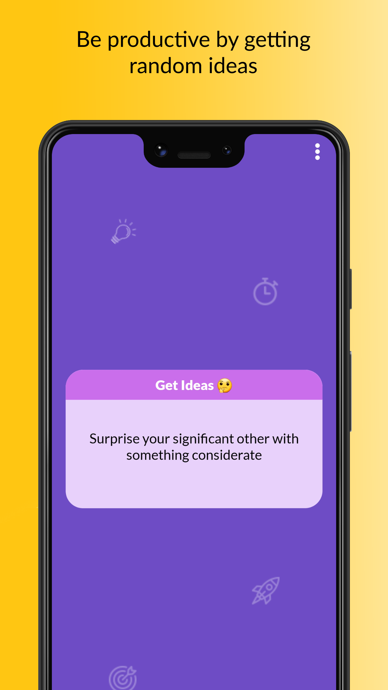
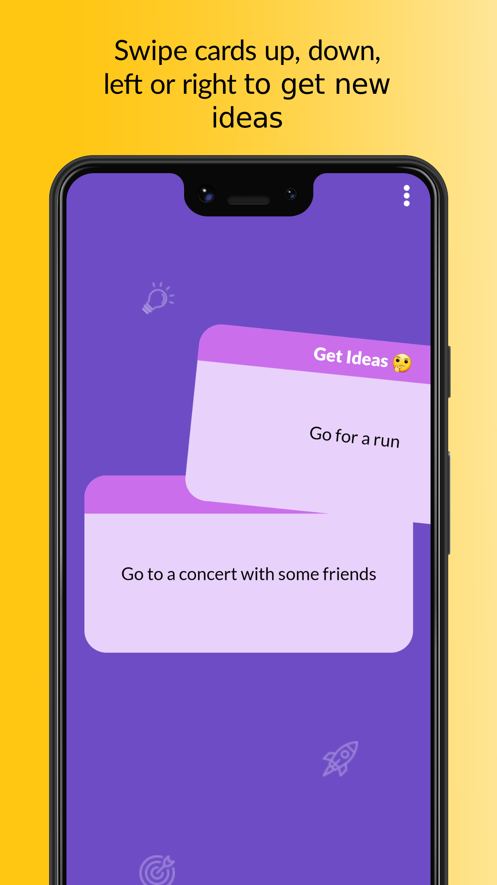
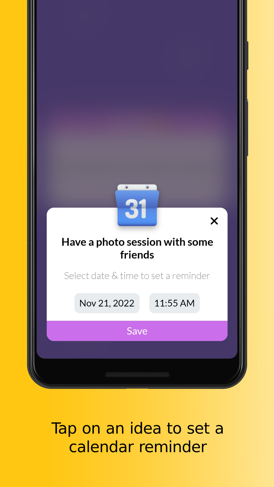
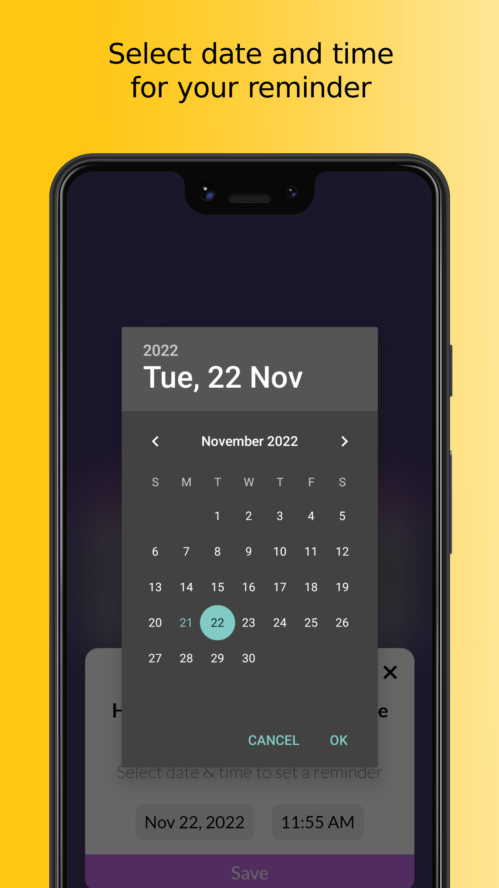
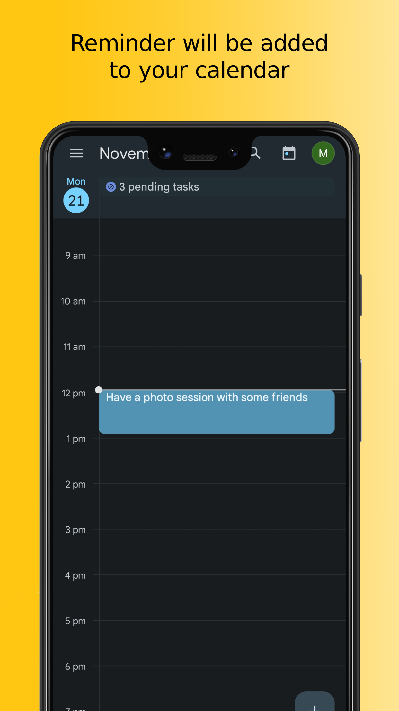
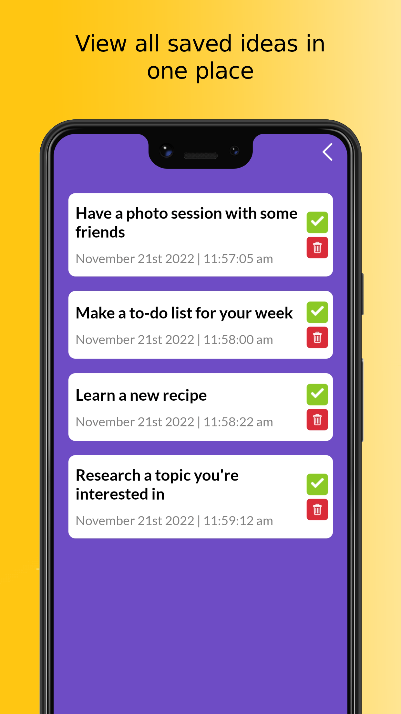

<h1>

# Get Ideas

</h1>

Get more done by getting the right ideas on time.

## Description

Get Ideas is a mobile app developed with React Native.

#### Note: If you want to test the app, an APK is present in the root.

<table>
<td>

</td>
<td>

</td>
<td>

</td>
<td>

</td>
<td>

</td>
<td>

</td>
</table>

## Features

- Swipe cards to get new ideas.
- Tap the idea to save an idea and setup a calendar reminder for it.

##### It uses https://github.com/drewthoennes/Bored-API to generate ideas.

## Contribution

PRs are most welcome, if you contribute by solving a bug, answering a query or by adding a new feature. Everything is appreciated.

## License

MIT
